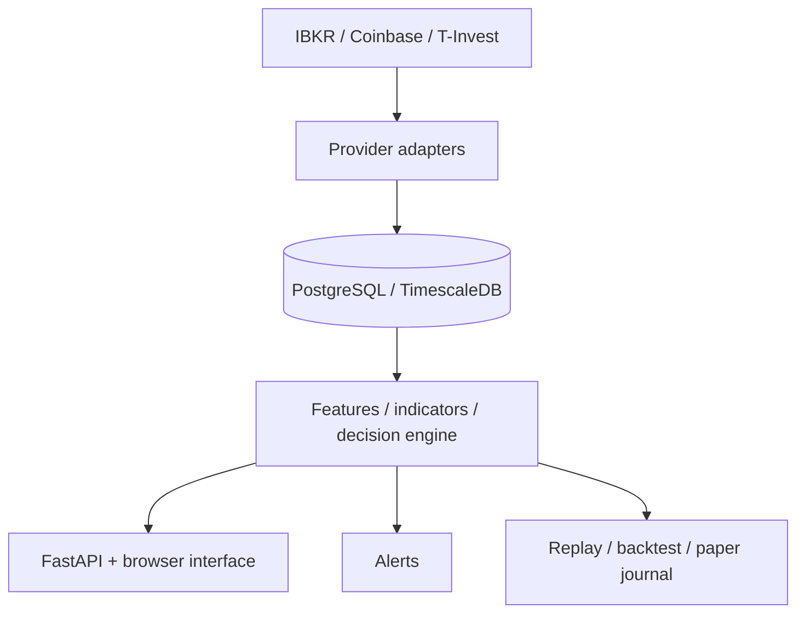

# MartinCall: product and technical portfolio

**A local workspace for exploring market data, reviewing signals and testing decisions through replay and paper trading.**

MartinCall is a personal, non-commercial project by **Grigory Shmykov**, developed with Gemini and Codex. It brings provider integrations, persistent data, analysis, alerts and a browser interface into one application.

## My contribution

I defined the product goals and requirements, broke work into deliverable tasks, directed AI-assisted implementation, reviewed architectural choices and tested results through repeated iterations. My focus is on how the system behaves: where its data comes from, how the operator interprets a signal, and what happens when information is incomplete or a component fails.

AI tools contributed substantially to the code. The project demonstrates requirements ownership, integration work, technical judgment and iterative delivery rather than a claim that I wrote every component manually.

## What the application does

| Capability | Why it matters |
|---|---|
| Provider-specific market data | IBKR, Coinbase and T-Invest data keep their provider identity; a different source is not silently treated as equivalent. |
| Charts and indicator analysis | The operator can inspect market facts and the signals derived from them in a browser. |
| Decision and signal lifecycle | Candidates, scenario decisions and execution intent have distinct responsibilities. |
| Replay, backtesting and paper trading | Historical evaluation and simulated execution can be examined without placing live broker orders. |
| Persistent state and runtime controls | PostgreSQL/TimescaleDB, schema checks and single-writer ownership make operational boundaries explicit. |
| Alerts and integrations | Notifications and API boundaries connect the terminal to external services while keeping domain state on the server. |

## Architecture at a glance

**Stack:** Python 3.14, FastAPI, Pydantic, NumPy, PostgreSQL/TimescaleDB, psycopg, JavaScript, Docker and pytest.

## Suggested review path

1. Start with the [product principles](PROJECT_IDEOLOGY.md): the intended user experience and decision boundaries.
2. Read the [system flow](ARCHITECTURE.md#system-flow) and [ownership map](ARCHITECTURE.md#ownership-map).
3. Trace [execution intent](../src/aef_terminal/engine/execution_intent.py) and the distinction between analysis and execution.
4. Review the [test navigation](../tests/README.md), then choose the contracts relevant to the area you want to inspect.
5. Use the [run instructions](../README.md#run) if you want a local installation. Provider access and a configured database are needed; this is not an anonymous hosted demo.

## A focused interview demonstration

I can walk through a selected instrument, the provenance of its data, the indicator/decision view and the corresponding replay or paper-trading workflow. A useful discussion is how the application distinguishes confirmed data, provisional state and unavailable information, and how that affects what the operator sees.

Current runtime scope ends at typed execution intent, alerts and paper trading: live broker order placement is a future product capability. This portfolio makes no claim of profitable trading, validated predictive performance or commercial adoption.

**Contact:** [Grigory Shmykov on LinkedIn](https://www.linkedin.com/in/grigory-shmykov-63b11016b/)

[Back to the project](../README.md)
