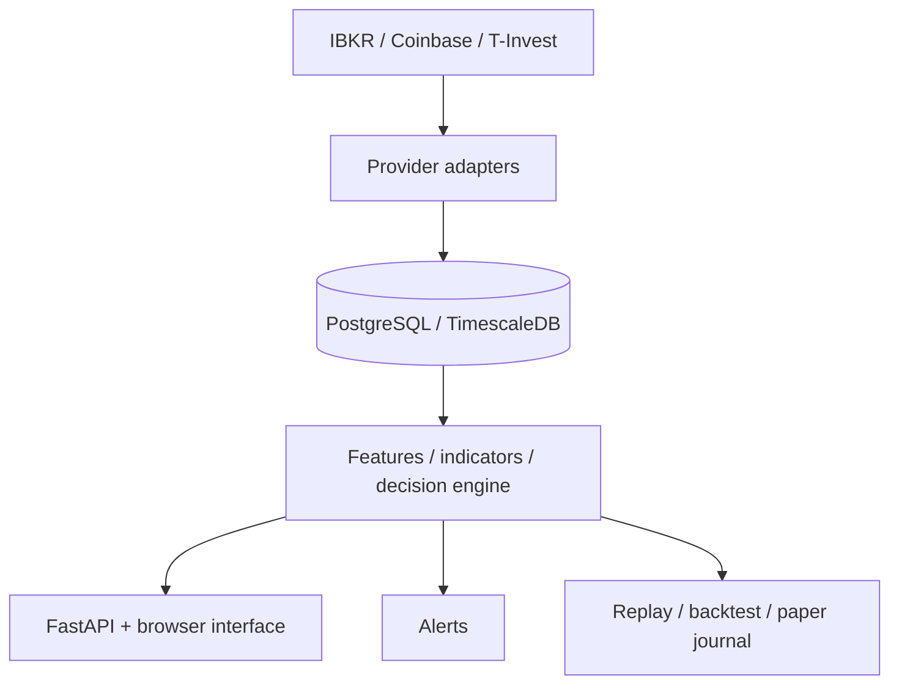

# MartinCall: product and technical portfolio

**A local workspace for exploring market data, reviewing signals and testing decisions through replay and paper trading.**

MartinCall is a personal, non-commercial project by **Grigory Shmykov**, developed with Gemini and Codex. It brings provider integrations, persistent data, analysis, alerts and a browser interface into one application.

## Role, contribution and evidence

I initiated MartinCall and owned its product direction from the original ideas through implementation, operational feedback and acceptance. I defined what the system should do, challenged proposed solutions and required rework until the result matched the intended behavior. The project makes my work in technical project management, systems integration and implementation leadership visible alongside my enterprise IT and manufacturing experience.

| My responsibility | Evidence a reviewer can inspect |
|---|---|
| Define the user problem and scope | [Product principles](PROJECT_IDEOLOGY.md): trusted data and auditable decisions before execution. Live broker order placement remains future work. |
| Control architectural consistency | [Ownership map](ARCHITECTURE.md#ownership-map) and [agent workflow](../AGENTS.md): responsibilities and constraints for implementation. |
| Break work into reviewable tasks | [Task list](TODO.md): goals, responsible areas, dependencies and acceptance criteria. The backlog records the next work and its acceptance conditions. |
| Check delivery and behavior | [Test navigation](../tests/README.md), [CI workflows](../.github/workflows/) and guided application review. A reviewer can follow an implemented requirement to its checks. |

**How I worked with AI.** Gemini and Codex contributed substantially to implementation. I set requirements, examined proposed approaches, tested behavior and requested corrections. A recurring part of my review was challenging unnecessary complexity, extra conditional paths and workarounds that bypassed the intended module boundaries. I required the underlying responsibility to be corrected rather than adding another parallel path. The result is a working personal system, developed through repeated implementation and review cycles. My confidence in it comes from examining behavior, diagnosing operational problems and checking corrections against requirements.

**Team experience outside this project.** At the factory I coordinated external 1C integrators with production, warehouse and accounting staff. For barcode-based shipping, I specified package/content relationships, scanning behavior and order validation; the integrator developed the handheld application. For product traceability, I selected and configured label-printing equipment, coordinated requirements with production and quality staff, trained operators and worked through integration issues. These were real enterprise implementations, separate from this portfolio code.

## Continuous development and acceptance

MartinCall represents **six months of continuous development**. I generated ideas, set direction, reviewed proposed approaches and implementation results, requested corrections and accepted completed work. The process repeatedly returned to performance, interface quality, integration behavior and architectural consistency as the application evolved in personal use.

The working cycle was: **idea or observed problem → requirements and proposed solution → review → AI-assisted implementation → behavioral checks and rework → acceptance → further operational feedback**. Code review and corrections formed part of these cycles. AI tools performed substantial implementation and assisted with technical analysis; I retained product direction and the decision to accept or request more work.

The repository exposes several parts of this process: [product principles](PROJECT_IDEOLOGY.md), the [architecture and ownership map](ARCHITECTURE.md), the [working backlog](TODO.md), [review rules](../AGENTS.md) and [test navigation](../tests/README.md). The private baseline contains 1,355 commits. That provides development provenance; the decisions, resulting behavior and checks are the substantive evidence.

The following case traces **one small iteration within this broader development effort**. It illustrates the link between my input and a delivered change; it is not intended to summarize the project's full scope.

## Example: from operational problem to product change

**Problem I observed:** the broker gateway repeatedly requested two-factor authentication. Missing a prompt left the operator without a clear way to start a fresh login from the terminal.

**My direction:** I reported the repeated prompts, requested a suitable restart schedule, and then asked for an explicit recovery control in the terminal settings. I reviewed the proposed behavior and authorized deployment after the implementation checks.

**Delivered behavior:** **New login** requests a fresh gateway authentication attempt; **API RST** reconnects API sessions separately. The implementation includes a cooldown and requires an explicit acknowledgement. Gateway supervision handles the login request without granting this control access to the database or general Docker administration.

**Inspectable evidence:** [login controller](../src/aef_terminal/ui/ibkr_gateway_login_control.py), [gateway supervisor](../deploy/hetzner/ib-gateway-control/supervisor.sh) and [tests for the request, acknowledgement and cooldown](../tests/test_ibkr_gateway_login_control.py). The change is included in the published source baseline. The development record captures the observation, requested change, implementation checks and deployment; private operational details are not published here.

**What this demonstrates:** noticing a real user problem, refining the requirement beyond an immediate restart, directing implementation and closing the delivery loop. AI implemented the code; I owned the requirement and acceptance.

## How to read the development history

The public repository starts with a source snapshot from a private baseline containing 1,355 commits. A small public commit count does not represent a one-step implementation. [Snapshot provenance](../PORTFOLIO_SNAPSHOT.md) identifies the exact baseline and publication checks. This is a dated review artifact, not a live mirror of every subsequent private change.

## What the application does

| Capability | Why it matters |
|---|---|
| Provider-specific market data | IBKR, Coinbase and T-Invest data keep their provider identity; a different source is not silently treated as equivalent. |
| Charts and indicator analysis | The operator can inspect market facts and the signals derived from them in a browser. |
| Decision and signal lifecycle | Candidates, scenario decisions and execution intent have distinct responsibilities. |
| Replay, backtesting and paper trading | Historical evaluation and simulated execution can be examined without placing live broker orders. |
| Persistent state and runtime controls | PostgreSQL/TimescaleDB, schema checks and single-writer ownership make operational boundaries explicit. |
| Alerts and integrations | Notifications and API boundaries connect the terminal to external services while keeping domain state on the server. |

## Architecture at a glance

**Stack:** Python 3.14, FastAPI, Pydantic, NumPy, PostgreSQL/TimescaleDB, psycopg, JavaScript, Docker and pytest.

## Suggested review path

1. Start with the [product principles](PROJECT_IDEOLOGY.md): the intended user experience and decision boundaries.
2. Read the [system flow](ARCHITECTURE.md#system-flow) and [ownership map](ARCHITECTURE.md#ownership-map).
3. Trace [execution intent](../src/aef_terminal/engine/execution_intent.py) and the distinction between analysis and execution.
4. Review the [test navigation](../tests/README.md), then choose the contracts relevant to the area you want to inspect.
5. Read the [run instructions](../README.md#run) for the installation requirements. Running a copy requires permission under the [license](../LICENSE.md); provider access and a configured database are also needed. A guided demonstration avoids those setup requirements.

## A focused interview demonstration

I can walk through a selected instrument, the provenance of its data, the indicator/decision view and the corresponding replay or paper-trading workflow. A useful discussion is how the application distinguishes confirmed data, provisional state and unavailable information, and how that affects what the operator sees.

The project demonstrates my product and implementation ownership. Professional software-team management and coding proficiency should be assessed from their own evidence.

Current runtime scope ends at typed execution intent, alerts and paper trading: live broker order placement is a future product capability. This portfolio makes no claim of profitable trading, validated predictive performance or commercial adoption.

**Contact:** [Grigory Shmykov on LinkedIn](https://www.linkedin.com/in/grigory-shmykov-63b11016b/)

[Back to the project](../README.md)
